# 網站部署
## 申請 GCP(Google Cloud Platform) 遠端主機
1. 進入 Google Cloud Platform 主頁面，在藍色導覽列，可以選取專案，然後會跳出一個視窗，可以看到目前自己的帳號有哪些專案，右上角有「新增專案」，可以自己新增一個專案。在選好哪一個專案後，要記得專案名稱＆ID，因為後面會用到。
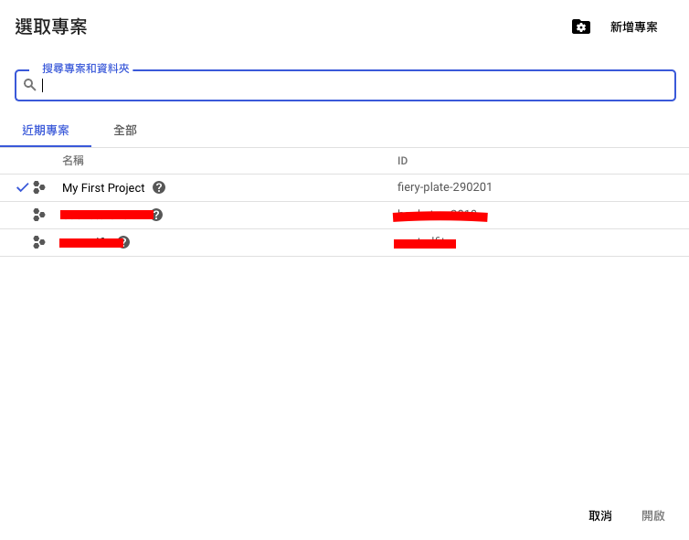
2. 接下來點選導覽列中最左邊的導覽選單，找到「運算」-> 「Compute Engine」-> 「VM 執行個體」，就可以開始建立選端主機。
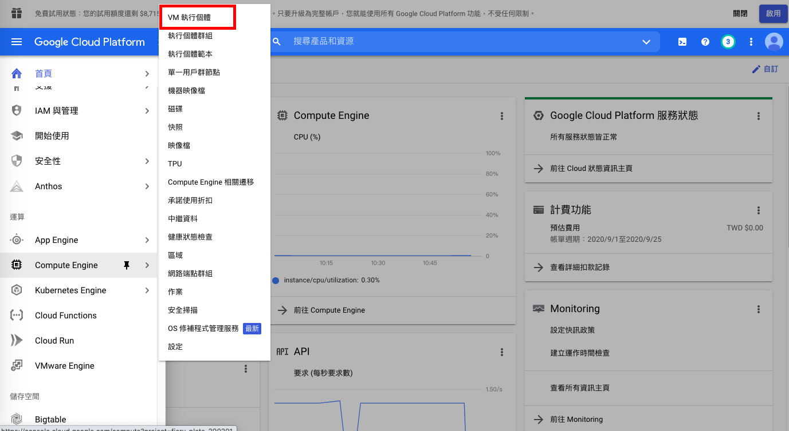
3. 點選「新增 VM 執行個體」，其餘沒有填寫的，就可以跳過，不影響申請。設定好以下條件，就可以按「建立」。
	  *  名稱：可以自行定義。
	  *  區域：區域選擇會影響費用與速度。
	  *  機器系列：就選擇預設的，選擇不同也會影響費用。
    *  防火牆：兩者皆勾選。
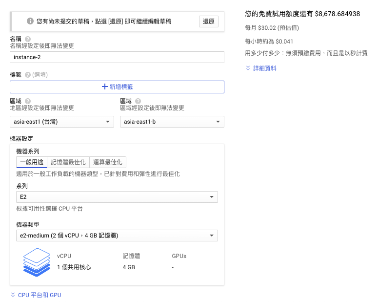
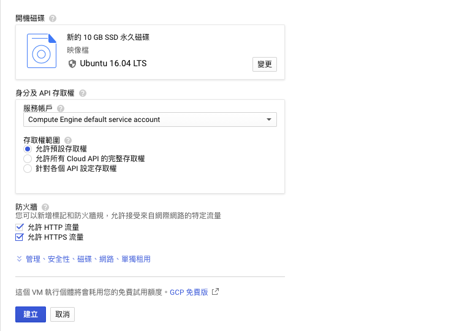

	  *  開機磁碟：選擇「變更」，如圖。
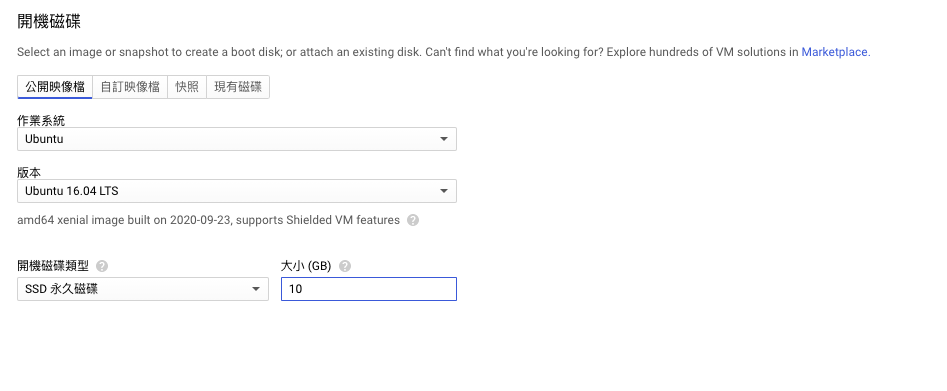
	  
4. 回到「導覽選單」->「VPC 網路」->「外部 IP 位址」。
	  * 類型：將「臨時」改為 「靜態」，然後會跳出一個小視窗，輸入名稱，可以自行定義，按下確認，完成。
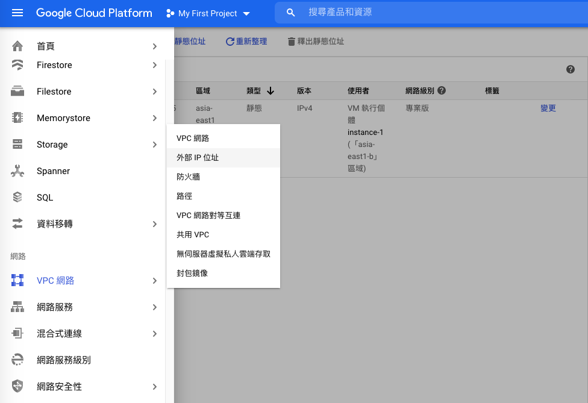
5. 回到 「VM 執行個體」，點「SSH」-> 「在瀏覽器視窗中開啟」，於是就會跳出黑色小框框。
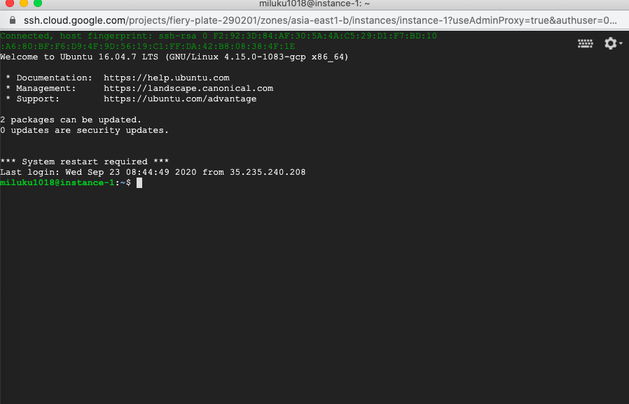

## 開始設置 LAMP
### 安裝 Apache & PHP
1. 在黑色小框框，依序輸入以下指令，如果有「Y/n」選項，一律選擇 Y 輸入即可。
```
sudo apt-get update 
```
```
sudo apt-get install apache2 php libapache2-mod-php
```

* 如果要確認是否已連上線，可以在瀏覽器輸入 http:// ＋ 「外部 IP 位址」，出現以下畫面代表安裝成功。
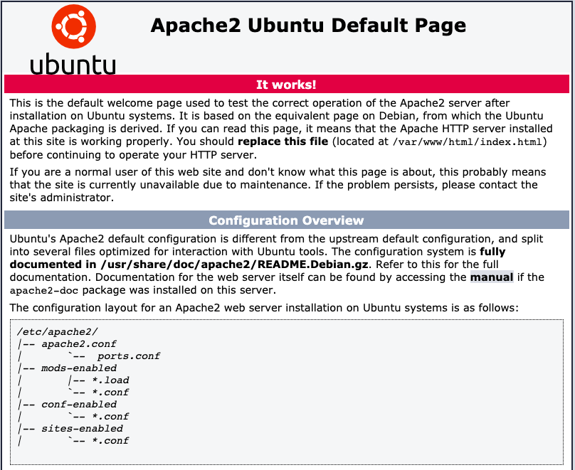
### 安裝 MySQL
1. 輸入以下指令，開始安裝。

```
sudo apt-get install mysql-server php7.0-mysql php-pear
```

2. 接下來會跳出紫色畫面，輸入兩次密碼，建立資料庫密碼。
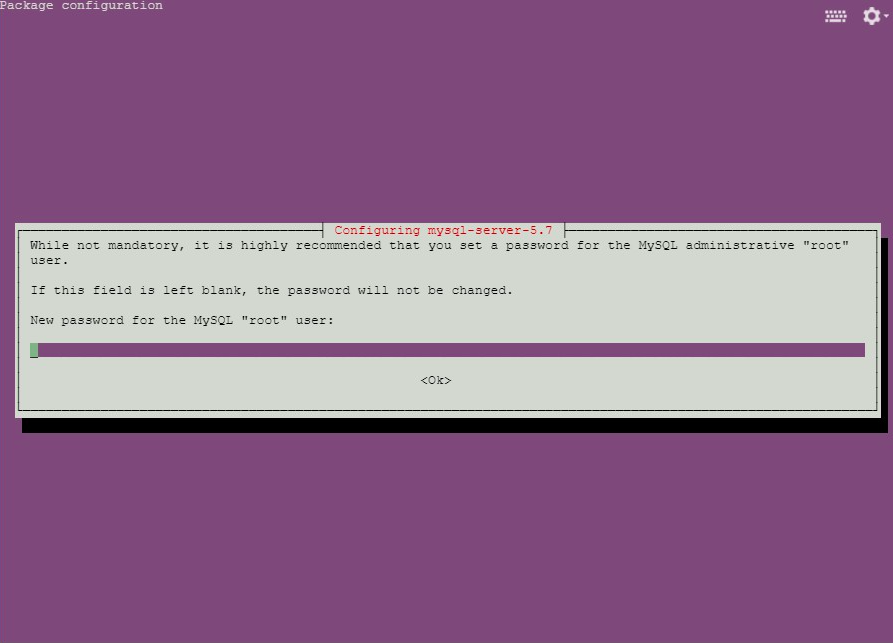
3. 接下來就要配置 MySQL 以提高安全性，輸入以下指令
```
sudo mysql_secure_installation
```
    ＊ 是否要設定 VALIDATE PASSSWORD 插件? y
    ＊ 密碼強度？0
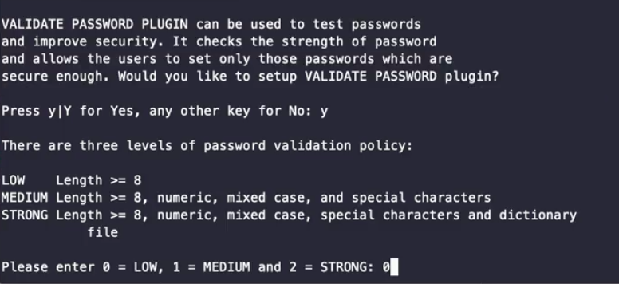
    *  輸入兩次新密碼
    *  接下來兩次詢問都是 y
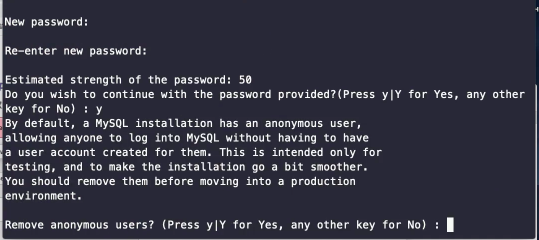
    *  是否移除匿名用戶？ y
    *  是否禁止遠端登入？ n ，只有這個選項是 n。
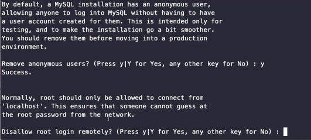
    *  接下來都選 y
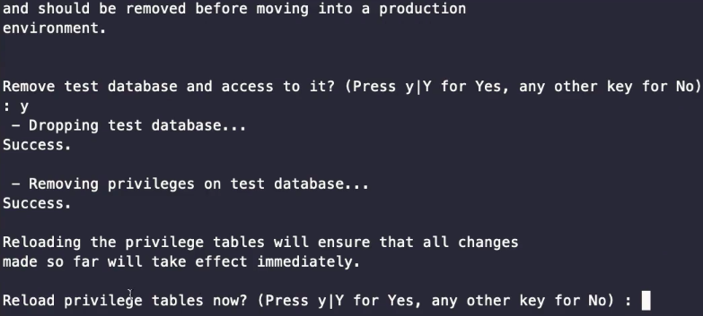

### 安裝 phpMyAdmin
1. 輸入以下指令，開始安裝。
```
sudo apt-get install phpmyadmin
```
2. 中間會有「Y/n」選項，按 Y 之後，會出現紫色畫面，選擇伺服器，
按下空白鍵，出現 * 字號，在 apache2 上，選擇完按 Enter。

3. 之後會要你輸入資料庫管理員密碼，一樣輸入兩次之後，就會繼續跑，安裝即完成。
4. 在瀏覽器網址列，輸入 http://「你的外部 IP 位址」＋「/phpmyadmin」，如果成功，就會顯示畫面。

### 安裝 Google Cloud SDK
*  Google 提供一個很好用的 CLI 介面工具，讓我們可以用指令的方式控制 GCP 的資源，這樣就可以直接在電腦上操作。
1.   [Google Cloud SDK ](https://cloud.google.com/sdk/docs/quickstart)，進入網頁後，下載檔案「google-cloud-sdk-311.0.0-darwin-x86_64.tar.gz」 ，解壓縮後放在固定位置，不要解壓縮到下載區。
2.   打開終端機，進入第 1 步驟檔案存放的位置，輸入以下指令
```
 google-cloud-sdk/install.sh 
```
3. 出現以下畫面，詢問是否要幫忙改善 Google Cloud SDK，按下 y
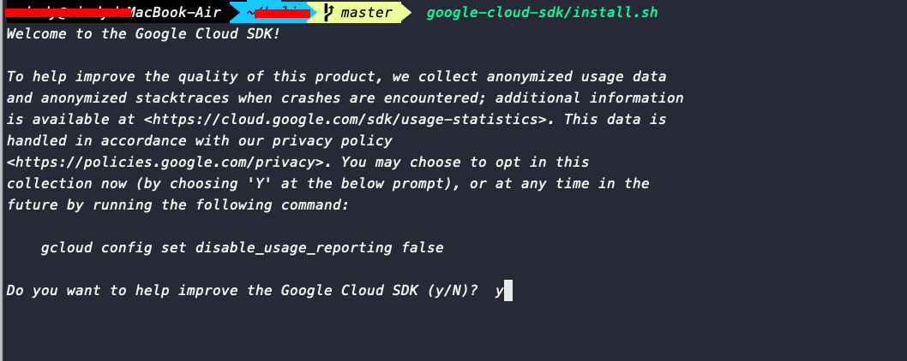
4. 接著說會修改 ~/.bash_profile 檔案，把 gcloud 的路徑加進去，按下 y
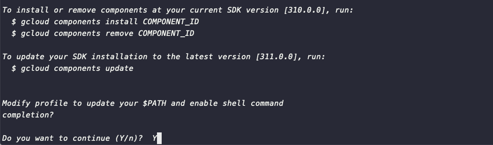
5. 再來會詢問以下問題，直接按 Enter 即可。

```
Enter a path to an rc file to update, or leave blank to use
```
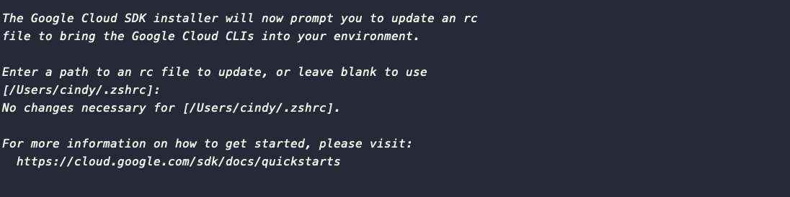
### 初始化設定 Google Cloud SDK
1. 另外開啟一個終端機畫面，輸入以下指令，接著詢問是否要登入，按 y
```
gcloud init
```

2. 瀏覽器會開啟 Google 登入的畫面，選擇要使用的 Google 帳戶＆ 按下「允許」Google Cloud SDK 存取我們在 Google Cloud Platform 上的資源。
3. 於是，就完成 Google Cloud SDK 與 Google 帳號綁定。
4. 登入後，選擇預設使用的專案，也就是一開始「申請 GCP(Google Cloud Platform) 遠端主機」的第一個步驟。
5. 專案選好之後，還可以修改一下 Google Compute Engine 的設定，按下 y
6.  要選擇 VM 的實體所在地，可以跟「申請 GCP(Google Cloud Platform) 遠端主機」選擇一樣的區域。初始化完成了。
7.  開始使用 gcloud 開 SSH 連線至 VM 裡面，在終端機輸入以下指令，將擁有的 VM 都列出來
```
gcloud compute instances list
```
8.  第一次使用 gcloud 連線，因此，gcloud 會幫忙建出 SSH 的 public/private key。輸入以下指令
```
gcloud compute ssh + 「要選擇連線的 VM 」
```
9. gcloud 會在 ~/.ssh 目錄下，產生出名叫 google_compute_engine 的公私鑰，接著就直接 SSH 連線到 VM 中，完成。

### 存放檔案到遠端主機上
1. 當連上遠端主機時，這時候在 terminal 輸入 pwd，查找目前所在路徑，可以看到你會在一個你所屬 gmail 帳號名稱的資料夾，
```
$pwd //home/miluku1018(帳號名稱)
```
2. 於是我們 cd / 指令退回至根目錄，這時候輸入 ls 可以看到很多子資料夾，接著要找到放網頁的目錄，這個目錄就是 /var/www/html
