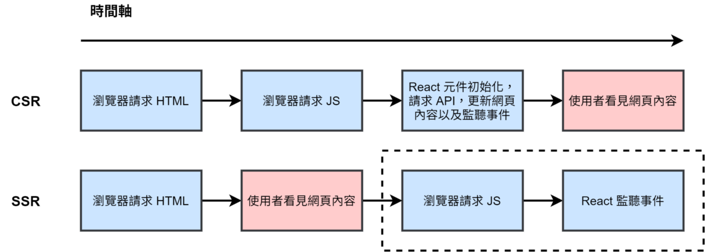

## Redux middleware 是什麼？

- 如同 express，送出 request 到 express server，而 express server 就會有很多 middleware，經過一系列 middleware 處理後，轉換出來一個 response，然後，再傳回去！
- 以下圖片說明 Redux middleware，當點擊一個事件後，dispatch an action，經過 Middleware，call API，然後再把 response 用 dispatch 的方式，dispatch 新的 action。轉換成要給 store 的新的 action。
- 如果有一個可以處理非同步事件的 middleware，就可以 dispatch 一個 fetch or promise function 出去，就在 middleware 完成 call API 這件事情，然後把 API response 存到 store 裡面去。

## CSR 跟 SSR 差在哪邊？為什麼我們需要 SSR？

如果是 CSR (Client Side Rendering) 瀏覽器請求 HTML 後，必須等待請求 JS 檔案，然後再等待 React 把元件 mount 到 DOM 上，以及請求 API 還會花費額外的時間。

此外，有些網站很注重搜尋引擎優化 (SEO)，搜尋引擎的原理即是爬蟲，而爬蟲通常不包含請求 HTML 後再請求 JS 檔案，所以如果是一般透過前端請求 API 後才載入資料，搜尋引擎便看不到網頁實際上的內容，不利於 SEO。

如果是 SSR (Server Side Rendering)，網頁的內容都會在伺服器端處理，爬蟲看到的即是包含完整內容的 HTML，便有利於進行 SEO。同時也有助於減少使用者從請求網頁到看見網頁內容時間，提升使用者體驗 (UX)。

資料來源：[https://medium.com/手寫筆記/server-side-rendering-ssr-in-reactjs-part1-d2a11890abfc](https://medium.com/%E6%89%8B%E5%AF%AB%E7%AD%86%E8%A8%98/server-side-rendering-ssr-in-reactjs-part1-d2a11890abfc)

## React 提供了哪些原生的方法讓你實作 SSR？

SSR 實際上的做法是當使用者進入某個 URL 時，會跟渲染伺服器請求 HTML，渲染伺服器會將 HTML 以字串的形式回傳給使用者，瀏覽器會解析 HTML 字串並顯示內容。

所以，首先我們先關注如何將一個 React Component 轉成字串。React 官方也有想到這一點，所以除了原本我們熟悉的 reactDOM.render 能夠渲染元件之外，也提供了在 SSR 中可以將元件轉換成 HTML 字串的解決方案。

renderToString()
官方文件：「這個方法將一個 React element render 至其初始的 HTML。React 將會回傳一個 HTML string。你可以使用這個方法在伺服器端產生 HTML，並在初次請求時傳遞 markup，以加快頁面載入速度，並讓搜尋引擎爬取你的頁面以達到 SEO 最佳化的效果。」

renderToString 並不會幫我們處理 event listener 的程式碼，因此，我們必須將 ReactDOM.render() 改為 ReactDOM.hydrate()，根據官方文件表示 React 將會嘗試附加 event listener 到現有的 markup。

資料來源：[https://medium.com/手寫筆記/server-side-rendering-ssr-in-reactjs-part1-d2a11890abfc](https://medium.com/%E6%89%8B%E5%AF%AB%E7%AD%86%E8%A8%98/server-side-rendering-ssr-in-reactjs-part1-d2a11890abfc)

## 承上，除了原生的方法，有哪些現成的框架或是工具提供了 SSR 的解決方案？至少寫出兩種

- Next.js 是 React 的 SSR 框架，Vue 也有類似的 SSR 框架叫做 Nuxt。**檔案架構即 Routing，**
  這是 Next.js 最大的特色之一，Next.js 會將在 page 這個資料夾下的檔案自動做 routing，例如 page/mypage.tsx 這樣的檔案路徑，就會自動顯示在 localhost:3000/mypage，以往需要自己處理的 routing，現在透過檔案架構就能輕鬆管理了。

- PreRender.io：預渲染頁面，通過執行頁面上的 JavaScript，然後呈現給搜尋引擎爬蟲。

資料來源：[https://kknews.cc/tech/engngl4.html](https://kknews.cc/tech/engngl4.html)

資料來源：[https://oldmo860617.medium.com/初探-server-side-rendering-與-next-js-推坑計畫-d7a9fb48a964](https://oldmo860617.medium.com/%E5%88%9D%E6%8E%A2-server-side-rendering-%E8%88%87-next-js-%E6%8E%A8%E5%9D%91%E8%A8%88%E7%95%AB-d7a9fb48a964)
